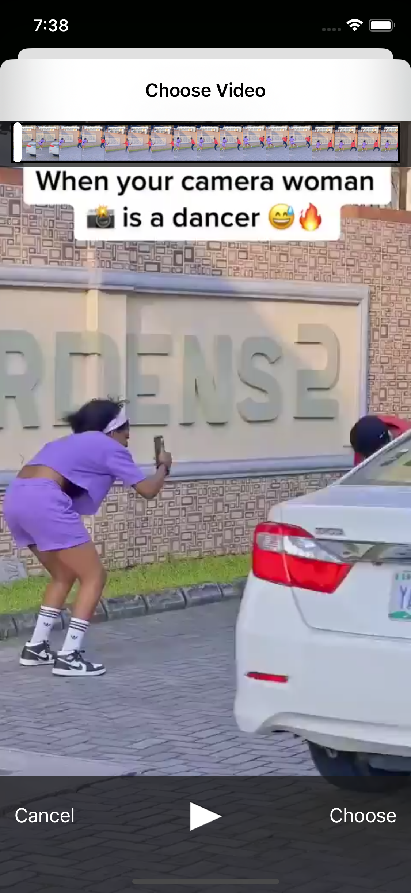
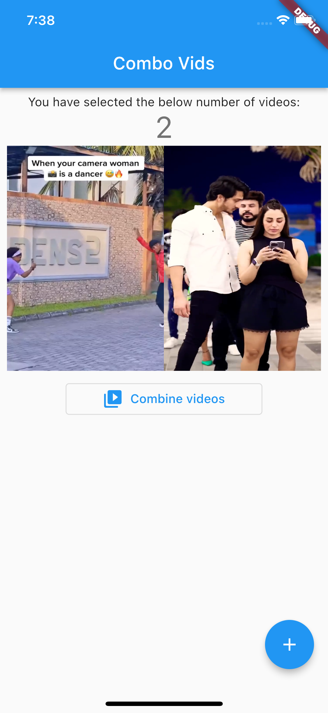
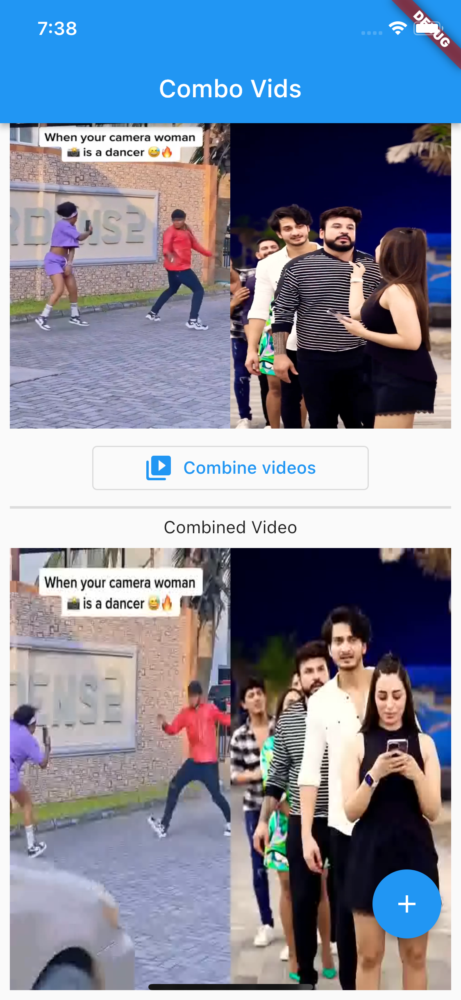

# 🔥🔥 Mchanganyiko

 

A simple project to demonstrate video combinations and the power of ffpmeg in flutter.

Star⭐ the repo if you like what you see😉.

## Quick Start 🚀

## Feature Set ✨

* [x] Free & Open Source
* [x] Cross Platform App (Android - IOS)
* [x] Usable and user-friendly interface
* [x] Proper architecture for the code (We tried)
* [x] Select videos
* [x] Combine videos
## RoadMap ✨
* [ ] UI Refresh
* [ ] Set audio for combined videos

## 📸 ScreenShots

| Image| Image|
|------|-------|
|||
|||
|||

## 🤓 Author(s)
**Samuel Abada** 